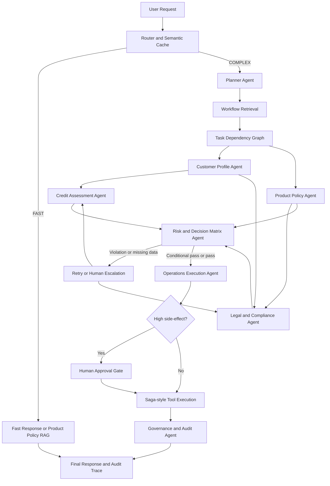

# Agent Workflow Overview

## Muc tieu

Tai lieu nay chia task cho team build demo 48h: Digital Expert Agents cho retail banking operations. He thong khong phai chatbot tu van vay von; he thong la workflow nhieu agent co tinh toan deterministic, compliance gate, tool action, human approval va audit trace.

Use case chinh:

- Khach hang ca nhan vay mua can ho hinh thanh trong tuong lai.
- Dong thoi tai tai tro khoan vay oto hien huu.
- He thong phai tinh DTI/LTV/EMI, kiem tra phap ly, chan pricing gan bao hiem, bao ve consent, tao approval/facility mock va dashboard trace.

## Agent set

| Agent | Nhiem vu chinh | Co the chay song song? |
| --- | --- | --- |
| Router & Planner Agent | Phan loai FAST/COMPLEX, tao dependency graph, dieu phoi workflow | Khong |
| Customer Profile Agent | Lay/normalize ho so khach hang, documents, consent registry | Co |
| Credit Assessment Agent | Tinh income haircut, EMI, DTI, LTV, restructure proposal | Co, sau khi co profile toi thieu |
| Product Policy Agent | Tra cuu policy san pham, rate, tenure, limit, eligibility | Co |
| Legal & Compliance Agent | Kiem tra insurance tying, marital property, project condition, consent | Co |
| Risk & Decision Matrix Agent | Tong hop finding, apply veto, gan final gate status | Khong |
| Operations Execution Agent | Tao approval letter, pending facility, condition precedent, notification | Khong |
| Governance & Audit Agent | PII masking, consent guard, cost/replay, audit events | Chay cross-cutting |

## Dependency graph



## Shared data contract

Moi agent nen tra ve structured output, khong tra text tu do.

```ts
type AgentStatus = "pending" | "running" | "completed" | "blocked" | "failed";

type FindingSeverity = "INFO" | "CONDITION" | "WARNING" | "BLOCKER";

type BlocksAt = "APPROVAL" | "CONTRACT_SIGNING" | "DISBURSEMENT" | "EXTERNAL_DATA_CALL" | "NONE";

type DecisionEnvelope = {
  decisionId: string;
  agent: string;
  status: "PASS" | "CONDITIONAL_PASS" | "VIOLATION" | "BLOCKED" | "FAIL";
  severity: FindingSeverity;
  blocksAt: BlocksAt;
  finding: string;
  evidence: Record<string, unknown>;
  ruleIds: string[];
  citations: string[];
  requiredFix?: string;
};

type ToolCallTrace = {
  toolName: string;
  input: Record<string, unknown>;
  output: Record<string, unknown>;
  status: "success" | "failed";
};
```

## Execution principle

- LLM khong tinh EMI, DTI, LTV.
- Rule engine quyet dinh dieu kien cung.
- Legal/Compliance co veto power.
- Khong co consent thi khong goi external API.
- HIGH side-effect tool chi chay sau human approval.
- Moi finding quan trong phai co rule ID/source.
- Dashboard chi hien PII da mask.

## Team split

Neu team 5 nguoi:

- Nguoi 1: Router & Planner + Risk Matrix.
- Nguoi 2: Customer Profile + seed case data.
- Nguoi 3: Credit Assessment.
- Nguoi 4: Product Policy + Legal/Compliance.
- Nguoi 5: Operations + Governance/Audit + frontend trace.

Neu team 7-8 nguoi, moi agent trong folder nay co the giao cho mot nguoi rieng.

